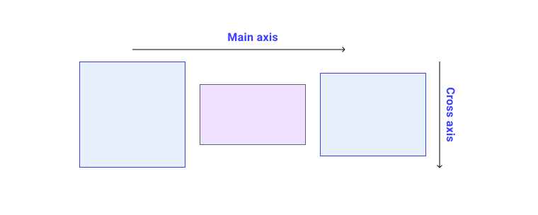

# Flexbox



## What is main axis? 
The main axis of a flex container is the primary axis along which flex items are laid out. Beware, it is not necessarily horizontal; it depends on the `flex-direction` property (`column`,`row`, `reversed-row`, `reversed-column`).

## What is cross axis?
The cross axis runs in the other direction to the main axis, so if `flex-direction` is `row` the cross axis runs along the `column`.

## What is `flex-flow`?
A shorthand for `flex-direction` and `flex-wrap`.

```css
p {
  flex-flow: row wrap;
}

p {
  flex-direction: row;
  flex-wrap: wrap;
}
```

## What is the difference between `flex-basis: content` and `flex-basis: auto`?
The `content` value will just set the width according to the element's content ("Hello world!"). It doesn't matter if you've defined a width for the element through the width property, it would be ignored.

HTML:
```html
<article>
  <p>Hello world!</p>
</article>
```

CSS:
```css
article {
  display: flex;
}

article p {
  width: 500px;  /* Width would be ignored because of `flex-basis: content` */
  flex-basis: content;
}
```

On the other hand, the `auto` value verifies if the width property was defined. If so, that will be the element's width (500px). If no, it will fall back to `flex-basis: content`.

HTML:
```html
<article>
  <p>Hello world!</p>
</article>
```

CSS:
```css
article {
  display: flex;
}

article p {
  width: 500px;
  flex-basis: auto;
}
```

## What would happen if we set `flex` to `initial`?
The default. Flex items do not grow to fill the space. 
They only take up space no more than their content's length.

```css
/* Shorthand version */
p {
  flex: auto;
}

/* Verbose version */
p {
  flex-grow: 0;
  flex-shrink: 1;
  flex-basis: auto;
}
```

## What would happen if we set `flex` to `auto`?
Flex items grow to fill the available space. The space is distributed as much
as it's needed. Longer text will take up more space than the rest of smaller items.

```css
/* Shorthand version */
p {
  flex: auto;
}

/* Verbose version */
p {
  flex-grow: 1;
  flex-shrink: 1;
  flex-basis: auto;
}
```

## What would happen if we set `flex` to  `1`?
Space will be disributed equaly to flex items.

```css
/* Shorthand version */
p {
  flex: 1;
}

/* Verbose version */
p {
  flex-grow: 1;
  flex-shrink: 1;
  flex-basis: 0;
}
```
