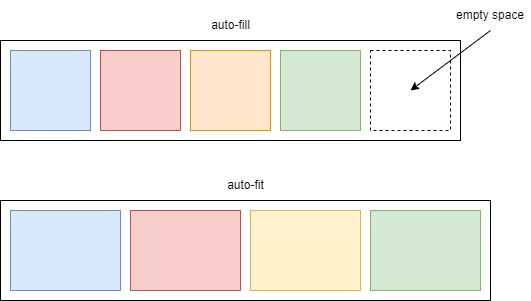

# Grid

It's a `block` element with super powers. Its child elements can be thought of as vehicles arranged in the parking lot. It suddenly has rows and columns. You need bigger area for trucks, smaller one for motorbikes, etc, etc. Magic! 

## Grid Terminology


## Rows and Columns

### Intrinsic Sizing Keywords
* `min-content` means the longest word in string
* `max-content` means it's wide enough for all of the words to display in one long unbroken string
* `fit-content` behaves like `max-content` at first, but when a parameter passed down to function, the content starts to wrap

### The `fr` Unit
Think `fr` unit as a fraction. The space in container is shared between each item. That's `1fr`. `2fr` is twice as much. `3fr` is thrice as much. That's all.
\
\


### The `minmax()` Function
As per the CSS spec, the definition of `minmax(min, max)` is as the following:

> Defines a size range greater than or equal to min and less than or equal to max.

Ahmad Shadeed wrote [article about `minmax()`](https://ishadeed.com/article/css-grid-minmax/). 
\
\


### `repeat()` Notation

```css
.container {
  display: grid;
  grid-template-columns: repeat(3, 1fr);
}
```
\


### `auto-fill` and `auto-fit`

`auto-fill` keyword:
```css
.container {
  display: grid;
  grid-template-columns: repeat(
    auto-fill,
    minmax(200px, 1fr)
  );
}
```

`auto-fit` keyword:
```css
.container {
  display: grid;
  grid-template-columns: repeat(
    auto-fit,
    minmax(200px, 1fr)
  );
}
```
\



## Auto-placement

### Placing Items In Columns

### Spaning Tracks

### Filling Gaps

## Placing Items

### Stacking Items

### Negative Line Numbers

## Named Grid Lines

## Grid Template Areas

## Alignment

### Distributing Extra Space

### Moving Content Around
