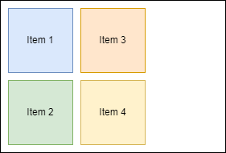
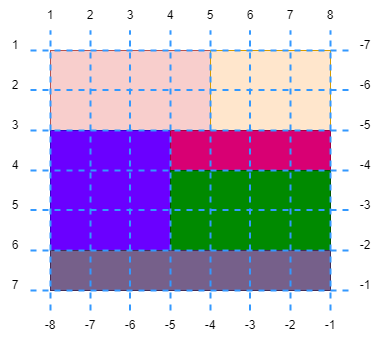
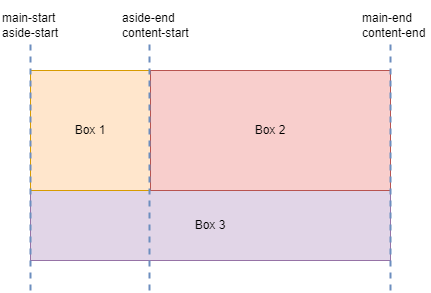
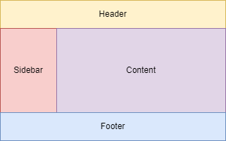
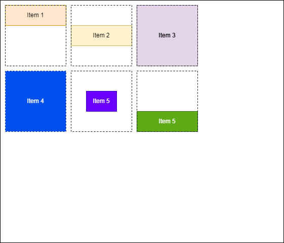
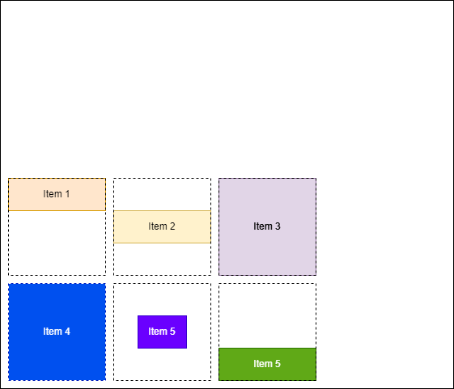
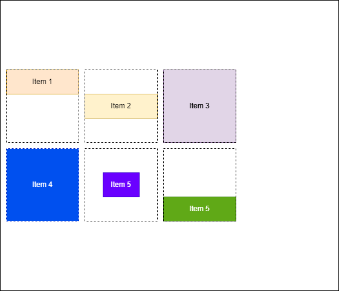
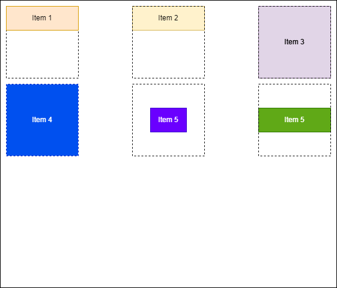
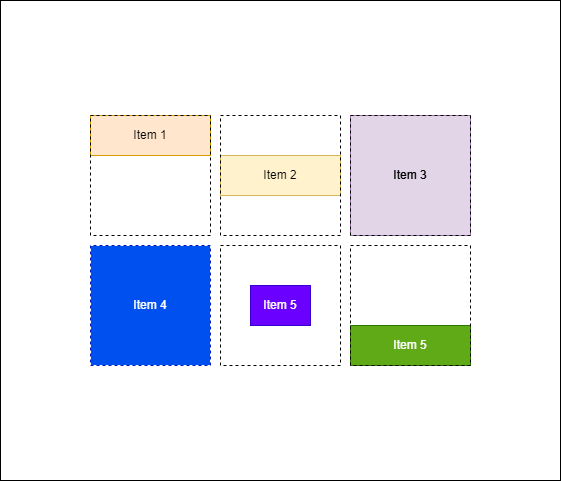
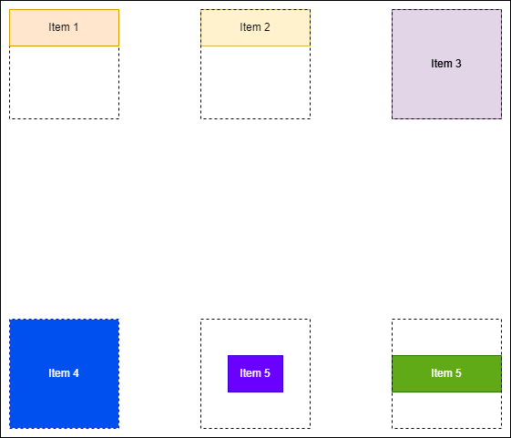

# Grid

It's a `block` element with super powers. Its child elements can be thought of as vehicles arranged in the parking lot. It suddenly has rows and columns. You need bigger area for trucks, smaller one for motorbikes, etc, etc. Magic! 

## Grid Terminology


## Rows and Columns 

```css
.container {
  display: grid;
  grid-template-columns: 200px 200px;
  grid-template-rows: 400px;
  gap: 10px;
}
```


### Intrinsic Sizing Keywords
* `min-content` means the longest word in string
* `max-content` means it's wide enough for all of the words to display in one long unbroken string
* `fit-content()` behaves like `max-content` at first, but when a parameter passed down to it, the content starts to wrap

### The `fr` Unit


### The `minmax()` Function
As per the CSS spec, the definition of `minmax(min, max)` is as the following:

> Defines a size range greater than or equal to min and less than or equal to max.

Ahmad Shadeed wrote [article about `minmax()`](https://ishadeed.com/article/css-grid-minmax/). 
\
\


### `repeat()` Notation

```css
.container {
  display: grid;
  grid-template-columns: repeat(3, 1fr);
}
```
\
\


### `auto-fill` and `auto-fit`

`auto-fill` keyword:
```css
.container {
  display: grid;
  grid-template-columns: repeat(
    auto-fill,
    minmax(200px, 1fr)
  );
}
```

`auto-fit` keyword:
```css
.container {
  display: grid;
  grid-template-columns: repeat(
    auto-fit,
    minmax(200px, 1fr)
  );
}
```
\


## Auto-placement
Items are placed on the grid one per cell in the order that they appear in the source.

### Placing Items In Columns

```html
<div class="container">
  <div class="box">Item 1</div>
  <div class="box">Item 2</div>
  <div class="box">Item 3</div>
  <div class="box">Item 4</div>
</div>
```

The default behaviour is like this: 


Here's when `grid-auto-flow: column` applied:



### Spaning Tracks
HTML:
```html
<div class="container">
  <div class="box">Item One</div>
  <div class="box">Item Two</div>
  <div class="box">Item Three</div>
  <div class="box">Item Four</div>
  <div class="box">Item Five</div>
  <div class="box">Item Six</div>
  <div class="box">Item Seven</div>
  <div class="box">Item Eight</div>
</div>
```
CSS:
```css
.container {
  display: grid;
  grid-template-columns: 5em 100px 30%;
  grid-template-rows: 200px;
  gap: 10px;
}
```

The default behaviour:
\
\


Here's when we apply `grid-column: auto / span 2` to the second item:
\
\


### Filling Gaps
HTML:
```html
<div class="container">
  <div class="box">Item 1</div>
  <div class="box">Item 2</div>
  <div class="box">Item 3</div>
  <div class="box">Item 4</div>
</div>
```

CSS:
```css
.container {
  display: grid;
  grid-template-columns: repeat(auto-fill, minmax(200px, 1fr));
}

.box:nth-child(1) {
  grid-row: auto / span 2;
}

.box:nth-child(3) {
  grid-column: auto / span 2; 
}
```

The default behaviour:
\
\


Here's when we apply `grid-auto-flow: dense` to `.container`:
\
\


## Placing Items
You can place items using grid lines.

HTML:
```html
<div class="container">
  <div class="box"></div>
  <div class="box"></div>
  <div class="box"></div>
  <div class="box"></div>
  <div class="box"></div>
  <div class="box"></div>
</div>
```

CSS:
```css
.container {
  display: grid;
  grid-template-columns: repeat(7, minmax(200px, 1fr));
  grid-template-rows: repeat(6, minmax(200px, 1fr))
}

.box:nth-child(1) {
  /* Verbose */
  grid-column-start: 1;
  grid-column-end: 5;
  grid-row-start: 1;
  grid-row-end: 3;

  /* Shorthand */
  grid-column: 1/5;
  grid-row: 1/3;
}

.box:nth-child(2) {
  /* Verbose */
  grid-column-start: 5;
  grid-column-end: 8;
  grid-row-start: 1;
  grid-row-end: 3;

  /* Shorthand */
  grid-column: 5/8;
  grid-row: 1/3;
}

.box:nth-child(3) {
  /* Verbose */
  grid-column-start: 1;
  grid-column-end: 4;
  grid-row-start: 3;
  grid-row-end: 6;

  /* Shorthand */
  grid-column: 1/4;
  grid-row: 3/6;
}

.box:nth-child(4) {
  /* Verbose */
  grid-column-start: 4;
  grid-column-end: 8;
  grid-row-start: 3;
  grid-row-end: 4;

  /* Shorthand */
  grid-column: 4/8;
  grid-row: 3/4;
}

.box:nth-child(5) {
  /* Verbose */
  grid-column-start: 4;
  grid-column-end: 8;
  grid-row-start: 4;
  grid-row-end: 6;

  /* Shorthand */
  grid-column: 4/8;
  grid-row: 4/6;
}

.box:nth-child(6) {
  /* Verbose */
  grid-column-start: 1;
  grid-column-end: 8;
  grid-row-start: 6;
  grid-row-end: 7;

  /* Shorthand */
  grid-column: 1/8;
  grid-row: 6/7;
}
```

Here's the illustration:
\


### Stacking Items
Items can overlap. Items which come later in the source will be displayed on top of items that come earlier. You can change this stacking order using z-index just as with positioned items.
\
\


### Negative Line Numbers
We can use negative line numbers to place items.

Here's the illustration:
\
\


We span to the last grid line with negative line numbers.

From this:
\
\

\
\
To this:
\
\


The negative line numbers only work on **explicit** grid.

## Named Grid Lines
Instead of numbers, you can name the grid lines to define the placement of items:

HTML:
```html
<div class="container">
  <div class="box">Box 1</div>
  <div class="box">Box 2</div>
  <div class="box">Box 3</div>
</div>
```

CSS:
```css
.container {
  display: grid;
  grid-template-columns: [main-start aside-start] 1fr [aside-end content-start] 2fr [content-end main-end];
  grid-template-rows: 300px 180px;
  grid-auto-rows: auto;
}

.box:nth-child(3) {
  grid-column: main-start / main-end; 
}
```
Here's the illustration:
\


## Grid Template Areas
We can name grid lines. We also can name grid areas. 

Let's say we have a layout like this:
\
\


We divide the layout into 8 columns and 5 rows.

HTML:
```html
<div class="container">
  <header>
    Header
  </header>
  <aside>
    Sidebar
  </aside>
  <main>
    Content
  </main>
  <footer>
    Footer
  </footer>
</div>
```

CSS:
```css
.container {
  display: grid;
  grid-template-columns: repeat(8, 100px);
  grid-template-rows: repeat(5, 100px);
  grid-template-areas:
    "header  header  header  header  header  header  header  header"
    "sidebar sidebar content content content content content content"
    "sidebar sidebar content content content content content content"
    "sidebar sidebar content content content content content content"
    "footer  footer  footer  footer  footer  footer  footer  footer";
}

header {
  grid-area: header;
}

aside {
  grid-area: sidebar;
}

main {
  grid-area: content;
}

footer {
  grid-area: footer;
}
```

## Alignment
Grid layout uses the same alignment properties as flexbox.

### Distributing Extra Space
Let's say we have extra space in our grid container.

HTML:
```html
<div class="container">
  <div class="box">Item 1</div>
  <div class="box">Item 2</div>
  <div class="box">Item 3</div>
  <div class="box">Item 4</div>
  <div class="box">Item 5</div>
  <div class="box">Item 6</div>
</div>
```

CSS:
```css
.container {
  display: grid;
  grid-template-columns: repeat(3, 200px);
  grid-template-rows: repeat(3, 200px);
  gap: 10px; 
  width: 1000px;
  height: 1000px;
}

.box {
  min-height: calc(200px / 3);
  min-width: calc(200px / 3);
}

.box:nth-child(1) {
  align-self: start;
}

.box:nth-child(2) {
  align-self: center;
}

.box:nth-child(5) {
  align-self: center;
  justify-self: center;
}

.box:nth-child(6) {
  align-self: end;
}
```

Here's the default behaviour:
\
\


If we want to place items at the bottom of container,
we can set `align-content: end`:
\
\


Or we place items at the center of container vertically,
we can set `align-content: center`:
\
\


What if we want to spread the space in between items horizontally?
We can set `align-content: space-between`:
\
\


We can also center vertically and horizontally with `justify-content: center` and `align-content: center`:
\
\


We can spread the space in between both vertically and horizontally with
`justify-content: space-between` and `align-content: space-between`:
\
\


You can also use these values: `space-evenly`, `space-around`, `baseline`, and  `stretch (default)`. [Read on](https://developer.mozilla.org/en-US/docs/Web/CSS/CSS_Grid_Layout/Box_Alignment_in_CSS_Grid_Layout).

### Moving Content Around
